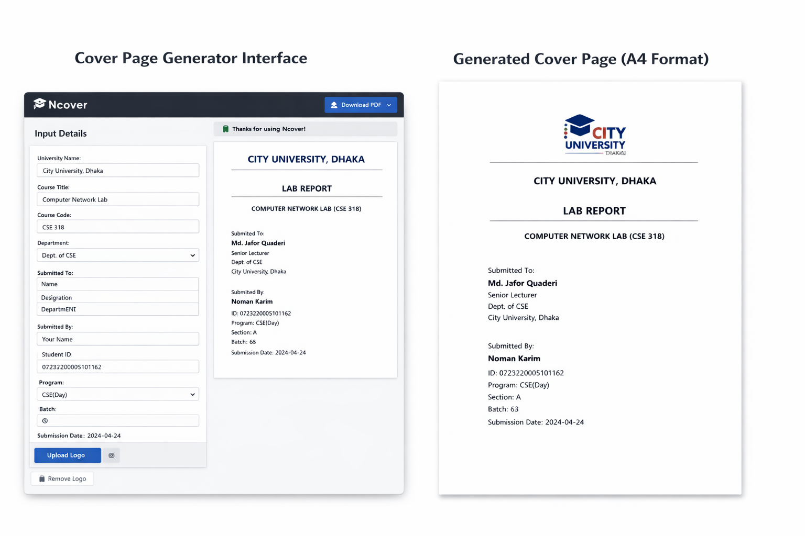

# 🎓 Ncover – Academic Cover Page Generator


**Ncover** is a modern web application that helps students quickly generate **professional A4 cover pages for assignments and lab reports**.

Instead of manually formatting documents in Word, students can simply enter their details and **download a clean PDF cover page instantly**.

---

# 🚀 Live Demo

```
https://nomankarim8.github.io/Ncover/
```

---

# 📸 Screenshots

### Cover Page Generator Interface


### Generated Cover Page (A4 Format)



---

# ✨ Features

✔ Create **Assignment Cover Pages**
✔ Create **Lab Report Cover Pages**
✔ Upload **University Logo**
✔ Enter **Teacher & Student Information**
✔ **Live A4 Preview** before download
✔ Export **High-Quality PDF**
✔ Clean **modern UI design**
✔ Fully **responsive layout**
✔ Print-ready **A4 format**

---

# 🛠 Tech Stack

| Technology   | Purpose                   |
| ------------ | ------------------------- |
| React        | Frontend framework        |
| TypeScript   | Type-safe development     |
| Tailwind CSS | UI styling                |
| html2canvas  | Convert HTML to image     |
| jsPDF        | Generate downloadable PDF |
| Lucide Icons | UI icons                  |

---

# 📦 Installation

Clone the repository

```bash
git clone https://github.com/nomankarim8/ncover.git
```

Move to project folder

```bash
cd ncover
```

Install dependencies

```bash
npm install
```

Run development server

```bash
npm run dev
```

Open in browser

```
http://localhost:5173
```

---

# ⚙️ How It Works

1️⃣ Enter university and course information
2️⃣ Fill **Submitted To** and **Submitted By** details
3️⃣ Upload **University Logo (optional)**
4️⃣ View **Live A4 Preview**
5️⃣ Click **Download PDF**

The system generates a **print-ready academic cover page**.

---

# 📄 Generated File Format

Downloaded files follow this format:

```
<Type>_<CourseCode>_<StudentID>.pdf
```

Example:

```
Lab_Report_CSE318_0272320005101162.pdf
```

---

# 📁 Project Structure

```
ncover
│
├── src
│   ├── App.tsx
│   ├── components
│   ├── styles
│   └── assets
│
├── public
├── screenshots
└── README.md
```

---

# 🎯 Use Cases

This project is useful for:

* University students
* Lab report submissions
* Assignment documentation
* Academic projects

---

# 👨‍💻 Author

**Noman Karim**

CSE Student
City University, Dhaka

---

# 📜 License

Licensed under the **Apache 2.0 License**.

---

# ⭐ Support

If you like this project, please consider giving it a **star ⭐ on GitHub**.

It helps the project grow and reach more students.
